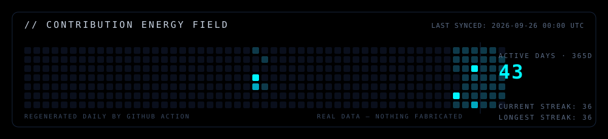

<code>STUDENT · BUILDER · AI/ML DEVELOPER</code>

---

## `// BOOT SEQUENCE`

---

## `// ABOUT THE SYSTEM`

Early-arc AI/ML builder. The work here is a workbench, not a portfolio: a vision-language model being trained from scratch instead of assembled from libraries, a small hosting experiment, and this profile — which is itself an instrument panel for a mind in progress.

What's real is measured. What isn't real yet is drawn as empty space, not as a claim.

---

## `// LEARNING CONSTELLATION`

Brightness and line weight reflect real depth, not invented percentages. The unmapped sky stays unmapped.

---

## `// CURRENT STACK`

| CATEGORY | STATE | TOOLS |
| --- | --- | --- |
| Core | `ACTIVE` | Python, NumPy, Pandas, scikit-learn |
| Deep learning | `LEARNING` | PyTorch, TensorFlow |
| Exploring | `EXPLORING` | LLM tooling, computer vision, MLOps |
| Tools | `ACTIVE` | Git, Linux, VS Code, Jupyter |

States are honest — no percentage bars, because a self-taught skill has no measured width.

---

## `// PROJECTS`

| PROJECT | WHAT IT IS | STACK | STATE |
| --- | --- | --- | --- |
| [VLM-1](https://github.com/piyush-AIML/VLM-1) | vision-language model built from scratch — ViT + Q-Former architecture | Python, PyTorch | `BUILDING` |
| [web-host](https://github.com/piyush-AIML/web-host) | small hosting experiment for multiple sites | HTML | `ACTIVE` |
| [this profile](https://github.com/piyush-AIML/piyush-AIML) | the artifact you're reading — hand-built SVG, regenerated telemetry | Markdown, SVG, Actions | `DEPLOYED` |
| `PROJECT SLOT // AWAITING BUILD` | — | — | `EMPTY` |
| `PROJECT SLOT // AWAITING BUILD` | — | — | `EMPTY` |

Two slots stay open on purpose. Empty space is where the next build lands.

---

## `// TELEMETRY`

regenerated daily by a GitHub Action · real data only · timestamped in-image

---

## `// WHERE THIS IS HEADED`

1. Finish what's started — keep the VLM-1 training loop honest and running
2. Open the lab — publish experiments and notebooks as they happen
3. Learn in public — notes on the from-scratch rebuilds, not summaries of tutorials

---

## `// REACH`

- GitHub — [piyush-AIML](https://github.com/piyush-AIML)

One channel for now. More open as the work earns them.

<!--
╔══════════════════════════════════════════════════════════════╗
║  PIYUSH.AI — instrument panel v2                              ║
║  hand-built SVGs: assets/ · action-generated: assets/generated/ ║
║  telemetry: .github/workflows/telemetry.yml (daily)           ║
╚══════════════════════════════════════════════════════════════╝
-->
