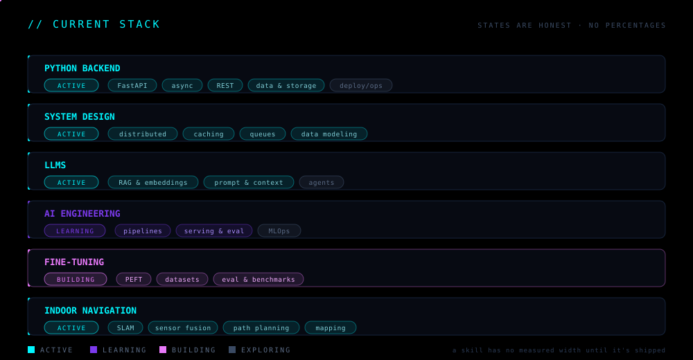
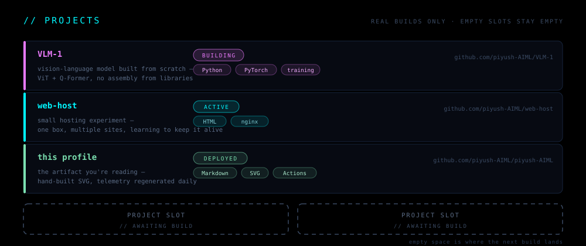
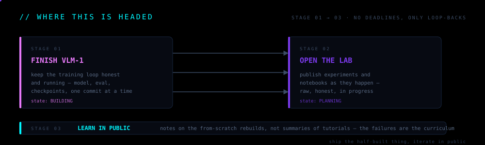

<code>STUDENT · BUILDER · LEARNING BY BUILDING</code>

---

## `// BOOT SEQUENCE`

---

## `// LEARNING CONSTELLATION`

** The real workflow, drawn as a graph: design → train → serve → monitor, with fast async pulses traveling every edge — real systems breathe, and so does this one. States are honest: a skill has no measured width until it's shipped. **

---

## `// CURRENT STACK`

Every module runs. Every state is honest — `ACTIVE` is what I use daily, `LEARNING` is what I'm deliberately deepening, `BUILDING` is what's hot right now. Current obsessions: RAG that actually retrieves, models that know what they don't know, and a robot that finds its way home.

---

## `// PROJECTS`

The empty slots are not a design gap — they're the contract. Empty space is where the next build lands.

---

## `// TELEMETRY`

regenerated daily by a GitHub Action · real data only · timestamped in-image

---

## `// WHERE THIS IS HEADED`

No deadlines — only loop-backs: build, measure, break, rebuild. The pulse keeps moving.

---

## `// REACH`

- GitHub — [piyush-AIML](https://github.com/piyush-AIML)

One channel for now. More open as the work earns them.

<!--
╔══════════════════════════════════════════════════════════════╗
║  PIYUSH.AI — instrument panel v2                              ║
║  hand-built SVGs: assets/ · action-generated: assets/generated/ ║
║  telemetry: .github/workflows/telemetry.yml (daily)           ║
╚══════════════════════════════════════════════════════════════╝
-->
